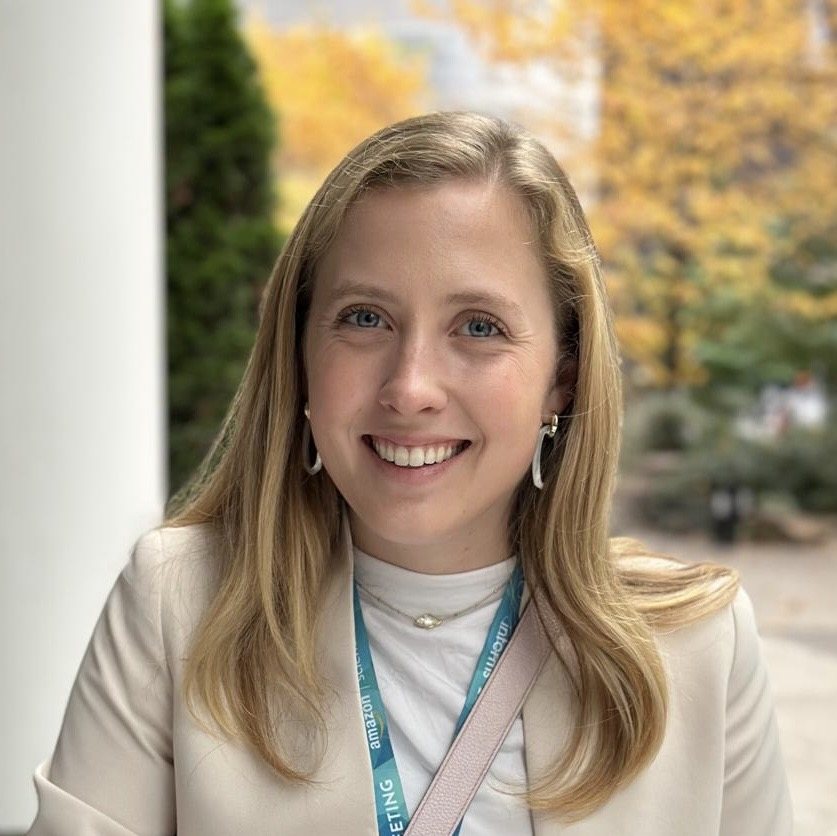

# About Me!

{: style="float: right; width: 300px; height: auto; border-radius: 50%; margin: 0 0 10px 10px;"}

I am a PhD Candidate in Operations Research at the Massachusetts Institute of Technology (MIT) advised by Prof. Swati Gupta. My research focuses on equitable decision-making frameworks using optimization and artificial intelligence for resource allocation problems with specific applications in healthcare, climate resilience, and policy. 

## Latest News
- **[October 2024]** I presented my talk "The Curse of Aggregation & Vulnerability Indices in Climate Resource Allocation" at the 2024 INFORMS Annual Meeting in Seattle, WA.
- **[August 2023]** I am honored to be the recipient of the MIT ORC's Henry Gabbay Fellowship!
- **[May 2023]** My senior design team from Georgia Tech won 1st place in the Senior Capstone Competition at IISE 2023 in New Orleans, LA! Thank you to our company sponsor Steelcase and Georgia Tech ISyE for this opportunity!
- **[May 2023]** I graduated from Georgia Tech! Next stop is MIT to pursue a Ph.D. in Operations Research.
- **[April 2023]** I was honored to receive the Davidson Family Tau Beta Pi Award at Georgia Tech. This honors the highest-performing undergraduate student in the College of Engineering Class of 2023.

See [news](news.md) for more updates.

