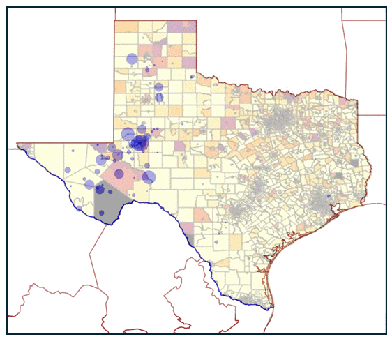

# Research
My current research focuses on developing optimization algorithms that enhance human-AI collaboration for equitable resource allocation in high-stakes decision-making. By integrating large language models (LLMs) with optimization techniques, I aim to create iterative frameworks that combine algorithmic speed with human expertise to refine policies. Some of my current projects include
- Multi-armed bandit algorithms for human-AI collaboration
- Intersecting optimization with policymaking in healthcare, energy, technology integration, and resource allocation
- Optimization for resource allocation under fairness constraints

Past research topics included sequential decision-making and optimizing equitable wildfire resilience policy.

Check out my papers below! 

1. **Equitably allocating wildfire resilience investments for power grids: The curse of aggregation and vulnerability indices** (to appear in *Applied Energy*). [See paper](https://arxiv.org/abs/2404.11520)
{: style="float: right; width: 300px; height: auto; margin: 0 0 10px 10px;"}
2. **The implications of state aggregation in deteriorating Markov Decision Processes with optimal threshold policies** (Major revision at *Computers & OR*). [See paper](https://arxiv.org/abs/2405.12912)
3. **Navigating the Social Welfare Frontier: Portfolios for Multi-objective Reinforcement Learning**

[View all preprints](https://arxiv.org/search/?query="Madeleine Pollack").